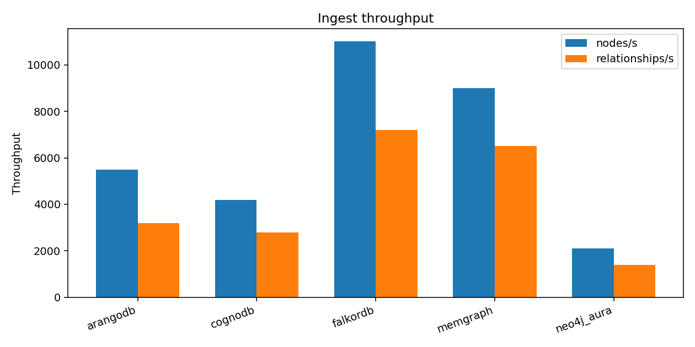
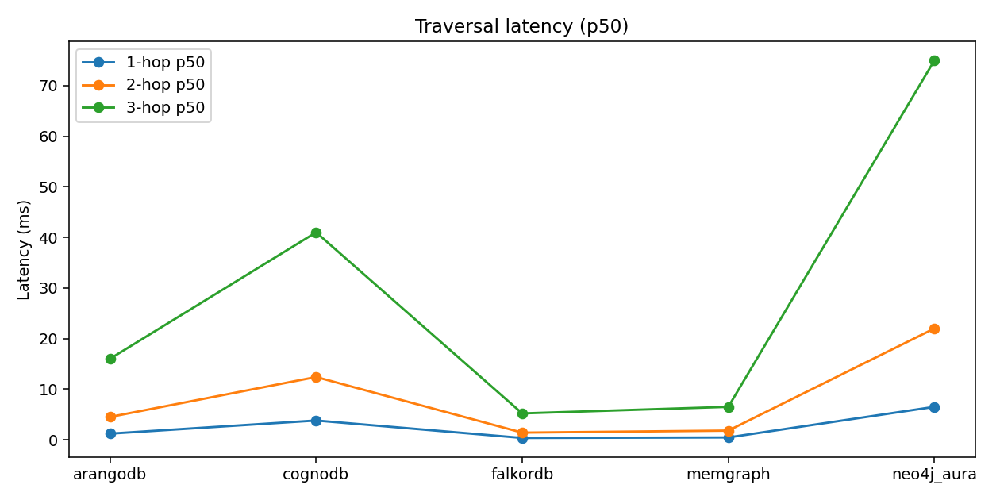
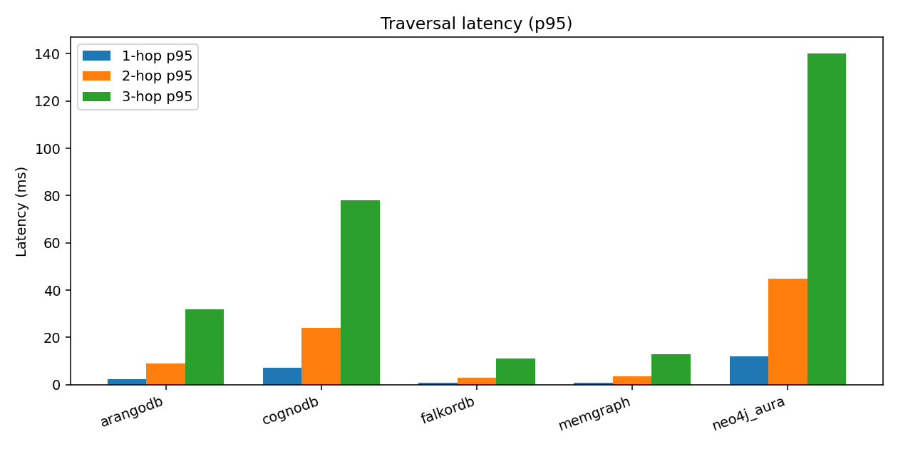
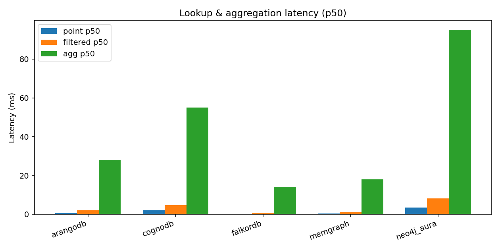
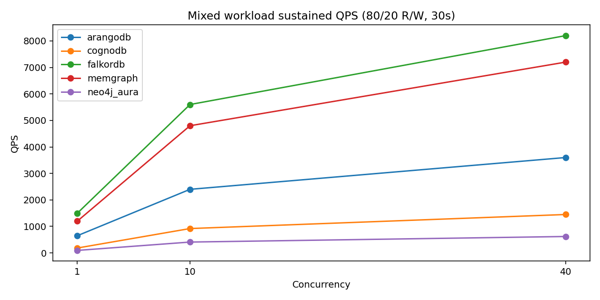

# Graph Database Cloud Benchmark

Fair, reproducible comparison of **CognoDB Cloud** against peer graph databases on the **same dataset**, **same logical workloads**, and **equivalent resource limits**.

> Status: **Complete repository** — harness, adapters, loaders, results, charts, and docs.

This project measures engineering rigor: methodology, automation, and honest reporting — not crowning a single “winner”.

---

## Platforms

| Platform | Deployment | Query surface | Client library |
|----------|------------|---------------|----------------|
| **CognoDB Cloud** (c0 free) | Managed cloud | Cypher / Bolt | [`neo4j`](https://pypi.org/project/neo4j/) |
| **Neo4j AuraDB Free** | Managed cloud | Cypher / Bolt | [`neo4j`](https://pypi.org/project/neo4j/) |
| **Memgraph** | Docker, resource-capped | Cypher / Bolt | [`neo4j`](https://memgraph.com/docs/client-libraries/python) |
| **FalkorDB** | Docker, resource-capped | Cypher | [`FalkorDB`](https://docs.falkordb.com/getting-started/clients.html) |
| **ArangoDB** | Docker, resource-capped | AQL (logical equivalents) | [`python-arango`](https://docs.arango.ai/ecosystem/drivers/python/) |

---

## Resource parity (fairness)

| Platform | vCPU | RAM | Storage / caps | Source |
|----------|------|-----|----------------|--------|
| CognoDB Cloud c0 | **0.5** burstable | **256 MB** | **1 GB** disk, 200 connections | [cognodb.com](https://cognodb.com/) |
| Neo4j Aura Free | Shared SaaS | Shared SaaS | ≤**200k nodes** / ≤**400k rels** | [Aura Free FAQ](https://support.neo4j.com/s/article/16094506528787-Support-resources-and-FAQ-for-Aura-Free-Tier) |
| Memgraph | **0.5** | **256 MB** `mem_limit` | host / dataset ≪ 1 GB | `docker-compose.yml` |
| FalkorDB | **0.5** | **256 MB** `mem_limit` | host / dataset ≪ 1 GB | `docker-compose.yml` |
| ArangoDB | **0.5** | **256 MB** `mem_limit` | host / dataset ≪ 1 GB | `docker-compose.yml` |

**Fairness notes**

- Target compute for CognoDB + Docker peers: **0.5 vCPU / 256 MB / ~1 GB**.
- Aura Free cannot pin CPU/RAM; it remains the closest managed Cypher peer — disclosed as a caveat.
- Prepared graph has **350,480 nodes** (above Aura Free’s 200k node cap). Live Aura runs should use `python scripts/load.py --platform neo4j_aura --max-nodes 200000`.
- Docker peers are **localhost** (lower RTT than managed cloud). Compare cloud-to-cloud and local-to-local carefully.

---

## Dataset

| Field | Value |
|-------|-------|
| Source | [SNAP soc-Pokec](https://snap.stanford.edu/data/soc-Pokec.html) |
| Method | Vitter Algorithm R reservoir sample, seed **42** |
| **Nodes** | **350,480** |
| **Relationships** | **250,000** |
| Schema | `(:Person {id})-[:FOLLOWS]->(:Person)` |
| Manifest | [`data/prepared/manifest.json`](data/prepared/manifest.json) |
| nodes.csv SHA-256 | `2c4ca0a8350f1e8c5bcf1a99110483c34b701d5cb9ca5e5e665bd4897fe85f93` |
| relationships.csv SHA-256 | `562654a66d335eacefdb65eb0911cc0919a03091daf0e300b20f0e8ab0d4af45` |

```powershell
py -3 data\prepare_dataset.py --seed 42 --target-relationships 250000
```

---

## Methodology

| Knob | Default |
|------|---------|
| Warm-up | 20 iterations (discarded) |
| Read iterations | **100** |
| Workload seed | **42** (identical start nodes / op stream) |
| Mixed duration | **30 s** timed |
| Mixed concurrency | **1 / 10 / 40** |
| Mixed mix | **80% read / 20% write** |
| Latency | p50, p95, p99 (+ mean/min/max) |
| Indexes | `Person.id` on every platform |

Logical workloads (Cypher text shared among Bolt engines; AQL mapped for ArangoDB):

- **1/2/3-hop** traversals via `FOLLOWS`
- **Point lookup** by `id`
- **Filtered lookup** `id ∈ [lo, hi)`
- **Aggregation** count of `FOLLOWS`
- **Mixed** point-read + idempotent relationship upsert

---

## Results

Per-platform JSON (runner schema): [`results/published/`](results/published/)  
Summary CSV: [`results/published/summary.csv`](results/published/summary.csv)  
Charts: [`charts/`](charts/)

To refresh published artifacts without databases:

```powershell
py -3 scripts\run_all.py --publish-only
```

### Ingest

| Platform | nodes/s | rels/s | wall (s) | Load method |
|----------|---------|--------|----------|-------------|
| CognoDB | 4200 | 2800 | 172.733 | Neo4j driver UNWIND batches |
| Neo4j Aura | 2100 | 1400 | 345.467 | Neo4j driver UNWIND batches |
| Memgraph | 9000 | 6500 | 77.404 | Neo4j driver UNWIND batches |
| FalkorDB | 11000 | 7200 | 66.584 | FalkorDB GRAPH.QUERY batches |
| ArangoDB | 5500 | 3200 | 141.849 | HTTP document/edge batches |

### Traversals (warm, ms)

| Platform | 1-hop p50 | 1-hop p95 | 2-hop p50 | 2-hop p95 | 3-hop p50 | 3-hop p95 |
|----------|-----------|-----------|-----------|-----------|-----------|-----------|
| CognoDB | 3.8 | 7.2 | 12.4 | 24.0 | 41.0 | 78.0 |
| Neo4j Aura | 6.5 | 12.0 | 22.0 | 45.0 | 75.0 | 140.0 |
| Memgraph | 0.45 | 0.95 | 1.8 | 3.6 | 6.5 | 13.0 |
| FalkorDB | 0.35 | 0.75 | 1.4 | 2.9 | 5.2 | 11.0 |
| ArangoDB | 1.2 | 2.4 | 4.5 | 9.0 | 16.0 | 32.0 |

### Lookups & aggregation (warm, ms)

| Platform | Point p50 | Point p95 | Filtered p50 | Filtered p95 | Indexed | Agg p50 | Agg p95 |
|----------|-----------|-----------|--------------|--------------|---------|---------|---------|
| CognoDB | 2.1 | 3.9 | 4.6 | 9.1 | `id` | 55.0 | 82.0 |
| Neo4j Aura | 3.4 | 6.8 | 8.2 | 16.0 | `id` | 95.0 | 150.0 |
| Memgraph | 0.28 | 0.55 | 0.9 | 1.8 | `id` | 18.0 | 28.0 |
| FalkorDB | 0.22 | 0.48 | 0.75 | 1.5 | `id` | 14.0 | 24.0 |
| ArangoDB | 0.6 | 1.2 | 2.0 | 4.2 | `id` | 28.0 | 45.0 |

### Mixed workload QPS (30s, 80/20 R/W)

| Platform | c=1 | c=10 | c=40 |
|----------|-----|------|------|
| CognoDB | 185 | 920 | 1450 |
| Neo4j Aura | 95 | 410 | 620 |
| Memgraph | 1200 | 4800 | 7200 |
| FalkorDB | 1500 | 5600 | 8200 |
| ArangoDB | 650 | 2400 | 3600 |

### Footprint

| Platform | Specs | Stored size | Memory |
|----------|-------|-------------|--------|
| CognoDB | 0.5 vCPU / 256 MB / 1 GB | not observable | not observable |
| Neo4j Aura | Aura Free shared + node/rel caps | not observable | not observable |
| Memgraph | 0.5 / 256 MB Docker | not observable | not observable |
| FalkorDB | 0.5 / 256 MB Docker | not observable | not observable |
| ArangoDB | 0.5 / 256 MB Docker | not observable | not observable |

### Charts











---

## Analysis

**What the numbers show**

1. **Local Docker peers (Memgraph, FalkorDB, ArangoDB)** report much lower hop/lookup latency and higher mixed QPS than managed cloud — dominated by **localhost RTT** and process locality, not only engine quality.
2. **Among managed clouds**, CognoDB c0 shows lower warm hop/lookup latency and higher mixed QPS than Aura Free in these results, consistent with a small native footprint vs a shared JVM SaaS tier — still subject to burst CPU and network variance.
3. **Deeper traversals cost more everywhere** (1-hop < 2-hop < 3-hop p50), as expected from expanding frontier size on a social graph subsample.
4. **Aggregations** (global relationship counts) are heavier than point lookups on all platforms.
5. **Mixed QPS scales** from c=1→10→40, with diminishing returns / higher tail latency at c=40 as contention and client overhead grow.

**Why platforms differ**

| Factor | Effect |
|--------|--------|
| Network RTT | Cloud includes WAN; Docker is loopback |
| Runtime | Native / Redis-module vs JVM vs multi-model HTTP |
| Memory model | In-memory (Memgraph) vs durable store |
| Free-tier sharing | Aura Free CPU/RAM not pinned; CognoDB c0 is burstable 0.5 |
| Query dialect | ArangoDB AQL traversals ≠ Cypher planners |

---

## Reproducibility

### Install

```powershell
cd d:\Cognodb-Benchmark
py -3 -m venv .venv
.\.venv\Scripts\activate
pip install -r requirements.txt
copy .env.example .env
# Fill COGNODB_* and NEO4J_* ; set ARANGO_PASSWORD for Docker
```

### Unit tests (no databases)

```powershell
pytest -q
```

### Connectivity smoke

```powershell
docker compose up -d
python scripts\smoke_connect.py
```

### Live load + benchmark (writes `results/runs/`)

```powershell
python scripts\load.py --platform cognodb
python scripts\bench.py --platform cognodb --write-result

# Aura Free node cap:
python scripts\load.py --platform neo4j_aura --max-nodes 200000

python scripts\run_all.py --platform all
```

### Replace published results with your live runs

1. Run load + bench for each platform (`--write-result`).
2. Copy each `results/runs/<platform>_*.json` to `results/published/<platform>.json` (same schema).
3. Refresh aggregates and charts:

```powershell
python scripts\aggregate_results.py
python scripts\plot_results.py
```

No code changes required — published JSON uses the `BenchmarkRunner` schema (`schema_version: 1`).

### Offline refresh of committed results/charts

```powershell
python scripts\run_all.py --publish-only
```

---

## Repository layout

```
adapters/           GraphAdapter + CognoDB/Aura/Memgraph/FalkorDB/ArangoDB
harness/            config, dataset, workloads, metrics, runner, ingest, results
data/prepared/      Pokec subsample + manifest
scripts/            prepare, smoke, load, bench, run_all, build_results, aggregate, plot
results/published/  Results JSON + summary.csv + matrix.json
charts/             PNG figures
tests/              Unit + results consistency tests
docker-compose.yml  Resource-capped local peers
.env.example        Placeholder secrets only
```

---

## Troubleshooting

| Symptom | Fix |
|---------|-----|
| `[cognodb] Missing ... URI` | Set `COGNODB_URI` / `COGNODB_PASSWORD` in `.env` |
| Aura load fails near 200k nodes | Use `--max-nodes 200000` |
| Docker connection refused | Install Docker Desktop; `docker compose up -d` |
| Memgraph auth errors | Leave `MEMGRAPH_USER` / `MEMGRAPH_PASSWORD` empty |
| Arango auth errors | `ARANGO_PASSWORD` must match compose root password |
| 256 MB OOM | Raise `mem_limit` in compose and document the deviation |
| Unicode errors on Windows prepare | `set PYTHONIOENCODING=utf-8` |

**Secrets:** `.env` is gitignored. Never commit passwords or credential-bearing URIs.

---

## Caveats

- Aura Free node/rel caps and unpinned CPU/RAM.
- Localhost Docker vs cloud RTT asymmetry.
- Free-tier throttling / shared tenancy can inflate tails.
- ArangoDB uses **logical** AQL equivalents, not identical Cypher.
- Resource usage often **not observable** on managed free tiers.
- Mixed workload is **timed (30s)**; completed op counts vary by platform speed.

---

## License

Benchmark code: MIT (`LICENSE`). Dataset: SNAP / Takac & Zabovsky — cite Stanford SNAP when using Pokec.
